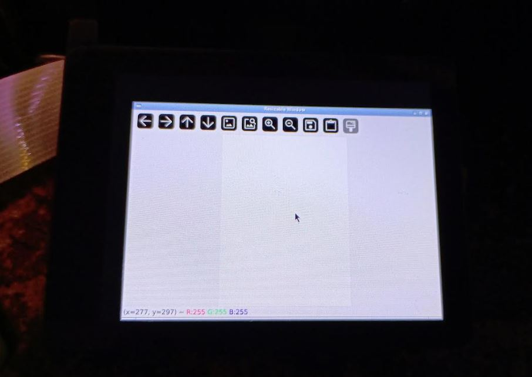

Tasks:

- [x] interface with waveshare 2.8" display (DSI no pins)
  - [x] get display working
  - [x] figure out how to display a dynamic image-based menu with no OS GUI
    - decided to use OpenCV stream
  - [x] get coordinate click
- [ ] interface with OLED (get pins)
- [ ] interface with 5D make sure center click works (get pins)
- [ ] interface with IMU (get pins)

### 01/03/2026

6:25 PM

I'm still stuck in 2025 apparently

Well I went out with the modular pi cam and minolta again, this time the AWB tune was yellow than pink ugh

It doesn't look crisp either, hard to focus... I want to blame the small sensor but idk I also am not good at photography

And I'm using automatic settings which the new pelicam menu will be able to set

So last time I was trying to get click detection to work, after that I'm going to interface with the OLED and then I'll do the IMU and buttons... which I've done in the past.

After this I'll be working on the software, and modeling parts and designing the body. The seafoam-green PLA arrived today ha.

6:40 PM

Okay we've got clicking nice and the coordinate

moving onto the 0.91" OLED now

7:12 PM

Soldered the GY-91 10-axis IMU

Plugged in the OLED, I didn't buy a waveshare labeled one but this might be a waveshare clone

Looking at their docs

https://www.waveshare.com/wiki/0.91inch_OLED_Module

Using GPIO 2/3 for the OLED

7:18 PM

Trying BCM2835

Then doing the python commands

Installing python3-pil as is not in venv

Spidev not sure, I first just did it in venv went through then tried outside (deactivate) already installed

downloading test demo

7:28 PM

Ran example says "Only Device_I2C, Please revise config.py !!!"

Enabling I2C in raspi-config

Did not work, looking for the config.py file

Oh I mean I specifically setup SPI for this, probably wrong GPIO pins?

Installing i2c tools to scan

https://learn.adafruit.com/scanning-i2c-addresses/raspberry-pi

Okay I had my SDA/SCK pins backwards, I'm using i2c 1 for the OLED, I see it show up 3c

Setting I2C to 1 in config.py

7:52 PM

I'm doing the GY-91 now which I've used in the pi-zero-hq cam so I should be able to just pull that

11:36 PM

I'm working on a video right now.

At this point the hardware's all figured out. Now to design and 3D print/program the menu.

---

### 01/02/2026

3:06 PM

Oh man I'm feeling it now Mr. Krabs, the juice is flowing

I thought I was working today, dumb...

Today I'll interface with the Waveshare display, I ordered another RPi HQ Cam and Pi 4B from Adafruit but still waiting for that.

I'll use the other Pi 4 I have currently.

8:01 PM

Working on interfacing with the 2.8" waveshare DSI display, first try was a failure lol

Trying to add dtoverlay from this thread [https://forums.raspberrypi.com/viewtopic.php?t=366011]

`dtoverlay=vc4-kms-dsi-waveshare-panel,2_8_inch`to `/boot/firmware/config.txt`

8:10 PM

OMG it's so beautiful!

The DSI cable is nice, that means it doesn't use any GPIO pins

Wiki has some info who knew

https://www.waveshare.com/wiki/2.8inch_DSI_LCD

Need the rotation

Looks like you chain the commands together like:

8:38 PM

I still haven't gotten this screen to rotate damn, I'm on trixie

Damn... it's funny I have no idea how this GUI DSI thing works...

I was expecting I could just "output an image" somehow to the display but it's I think HDMI out and it's only outputting the terminal... so I don't know how I'd output my custom image-based menu.

Still researching, I may have to go back to a full OS install and then boot some kind of Python GUI there if I can't do it from lite.

I'm not sure if I really want to write my own X11 display thing to accomplish this.

8:50 PM

The thing is my menu system isn't even streaming video (until it gets to the camera pass through then it would have to)

It's just pulling pre-made menu images based on the menu state to show

https://forums.raspberrypi.com/viewtopic.php?t=152264

That looks interesting, openbox although I wouldn't use tkinter

8:52 PM

Okay intalling `openbox`

also installing `xinit`

Idk what myapp is will see

8:58 PM

Yoooo there's a little mouse lmao

I still don't understand how to control what is shown but this is something.

9:03 PM

It seems I have to use xrandr so installing that via `x11-xserver-utils`

Okay I got it rotated with just `rotate -o left`

The touch is not rotated

Need `xinput`

oohhhhh man's learninnnn

`DISPLAY=:0 xinput`

after it's running but I'm just trying to figure out what input to target

https://askubuntu.com/questions/368317/rotate-touch-input-with-touchscreen-and-or-touchpad

9:12 PM

Still not working but the device name is `10-0014 Goodix Capacitive TouchScreen`

Yeah when I move my thumb up in landscape mode the cursor goes left

9:20 PM

Tried rotating through boot firmare config file no dice

9:32 PM

Alright I got it, there was an error saying "device name shows up multiple times"

I had to use the device ID

So I've got custom window, rotated display and input

I still don't know how to output something specific like a picture

9:58 PM

Okay I think I understand how this works

You need to produce a window bare minimum.

Then the GUI is in that, in my case it's just static images that change based on the menu state but also I can inject the camera frames for the live pass through.

It seems like I can use OpenCV for it which seems overkill but if it works...

10:01 PM

I'm in the zone autozone baby

I did think about what the OLED could show, it could show the settings of the camera or specific profiles

10:20 PM

Install pip

need to pip install cv2, numpy

sudo apt install python3-pip

10:23 PM

alright guess I'll setup a virtual environment, confusing with display vs. actual camera code

python3 -m venv pelicam

source pelicam/bin/activate

pip install opencv-python

Had to add this script type as it thinks it's shell

10:36 PM

deactivate to leave

10:40 PM

Cool we have a display!

I'll get rid of the extra crap but yeah

10:55 PM

Okay so that this point I have a blank menu now

Trying to figure out how to hide the cursor right now

using unclutter

https://superuser.com/questions/442416/can-i-hide-the-mouse-cursor-in-openbox

11:04 PM

This works

https://bbs.archlinux.org/viewtopic.php?id=43947

Although when you click it shows up, so I guess I'll have to do the transparent theme

11:12 PM

REEEEEEEEEE lmao I can't get this cursor to go away, it's mostly away

But when you touch the screen it shows up very briefly and goes away again

Since the menu is not clickable I'm going to have to have a thread that's listening for touch input then pass that on to the menu system

11:49 PM

Alright I'm spent today, I was trying to get clicks to be detected, doesn't seem like it's working

Not sure if that's a touch thing with openbox or what

Also need to verify the framerate of the imshow, I was initially going for 60fps but I could be fine with 30fps

---

### 01/01/2026

8:08 PM

I feel like I'm being bad by not following through with my projects. I was supposed to design the dead space 3 scavenger robot and make it/paint it but I didn't get around to it.

I kind of lost the drive after a while. I will complete it at some point, I'm feeling interest in making this camera instead though even though outside it's winter so everything is brown and dead here in the midwest.

I started buying a bunch of parts, I'm looking at wide angle lenses next to try.

I'm also looking into tuning the camera for the Minolta 50mm F1.7

Did a base design, ordered the sea-green filament

9:18 PM

I guess I didn't have to buy 3 different brands of these adapters oh well.

Also seems like most of the single-digit focal length lenses are fish eye.

So I'm not sure, I don't want that skewing/warping problem.

10:10 PM

I design the cameras inside-out, I start by modeling the parts and then fit them inside a shell.

Of course here I have a design I want in mind but yeah.

This is what happens though when you use off-the-shelf parts.

11:58 PM

I think I have almost all of the parts to build this camera already. I do have to wait for the OLED now that I decided to add.

I'll need to model all the parts and get the other adapters to check their dimensions, make sure they fit.
